# Local AI Stack — native Windows mode

A self-hosted multi-model LLM workflow that runs entirely on a single Windows
machine. A FastAPI backend routes each chat request to one of six llama.cpp
tiers (four chat, one vision, one embedding) with a VRAM-aware scheduler, a
multi-agent orchestrator, per-user RAG + memory, and an OpenAI-compatible
SSE endpoint.

**No Docker. No browser dependency. No Electron.** Ships as a single
PowerShell launcher (`LocalAIStack.ps1`) and a native PySide6 desktop app.

<p align="center">
  
</p>

## Quickstart

**Requires PowerShell 7 or higher.** The launcher refuses to run under
Windows PowerShell 5.1 (em-dashes in string literals break 5.1's
Windows-1252 default parser). If `pwsh` isn't installed:

```powershell
winget install --id Microsoft.PowerShell --source winget
```

Then:

```powershell
pwsh .\LocalAIStack.ps1 -InitEnv   # write a default .env (edit it: secrets, optional Brave key)
pwsh .\LocalAIStack.ps1 -Setup     # install prereqs, download binaries, create venvs, pull models
pwsh .\LocalAIStack.ps1            # start everything and launch the native Qt GUI
```

After cloning, opt in to the auto-refresh git hook so future `git pull`s
restart the backend with the new code:

```powershell
git config core.hooksPath .githooks
```

This wires up [`.githooks/post-merge`](.githooks/post-merge), which calls
[`scripts/refresh-backend.ps1`](scripts/refresh-backend.ps1) — diffs the
pull, `pip install`s any `requirements.txt` changes, and bounces the
backend so the new tool registry + admin endpoints are live without
manual intervention. The hook is gated to fire **only on pulls from
`origin`** (it ignores local merges, rebases, and pulls from other
remotes).

To **auto-pull on every PR squash+merge**, register the polling task —
it checks origin every 2 minutes and ff-pulls when a new commit is up:

```powershell
pwsh .\scripts\install-auto-pull.ps1                 # default: every 2 min
pwsh .\scripts\install-auto-pull.ps1 -IntervalMinutes 5
pwsh .\scripts\install-auto-pull.ps1 -Uninstall      # remove the task
```

The end-to-end chain is then:

> PR squash+merge on GitHub → `poll-origin.ps1` (≤2 min) → `git pull --ff-only` →
> `.githooks/post-merge` → `refresh-backend.ps1` → backend restarts on new code

The chat web UI ([`backend/static/chat.html`](backend/static/chat.html))
detects the brief restart window via a `/healthz` heartbeat and shows a
banner with an ETA so users see "*backend is refreshing — resuming in
~Xs*" instead of a confusing "Failed to fetch" error.

All operator instructions — daily commands, cloudflared ingress snippet,
log locations, model update policy, uninstall — live in:

```powershell
pwsh .\LocalAIStack.ps1 -Help
```

## What ships

| Path | What it is |
|---|---|
| [`LocalAIStack.ps1`](LocalAIStack.ps1) | One-file launcher: `-InitEnv`, `-Setup`, `-Start`, `-Stop`, `-Build`, `-BuildInstaller`, `-CheckUpdates`, `-Admin`, `-Test`, `-Help` |
| [`backend/`](backend/) | FastAPI app on `:18000` (chat SSE, auth, admin, RAG, memory, VRAM scheduler) |
| [`gui/`](gui/) | PySide6 native desktop app (chat, admin, diagnostics, metrics, setup wizard, system tray) |
| [`config/`](config/) | YAML-driven configuration (tiers, sources, router, VRAM, auth, tools) |
| [`tools/`](tools/) | 90+ discoverable tool modules (web, finance, science, data, dev) |
| [`tests/`](tests/) | Pytest suite + `local_health.py` health check (CI runs without GPU) |
| [`installer/`](installer/) | Inno Setup script + PyInstaller spec for the Windows installer |
| [`docs/streaming.md`](docs/streaming.md) | Jellyfin media server at `stream.mylensandi.com` (sibling cloudflared ingress, gated by Cloudflare Access email allowlist) |
| [`scripts/steps/`](scripts/steps/) | Helpers dot-sourced by `LocalAIStack.ps1` |
| `vendor/` *(generated)* | Pinned Qdrant + llama-server binaries and three Python venvs |
| `data/` *(generated)* | SQLite, encrypted histories, Qdrant storage, resolved-model cache, `.env` |

---

## GUI overview

The native desktop app lives in [`gui/`](gui/) and is built on PySide6
(no embedded browser, no JavaScript). Six windows cover the complete
operator surface; below is each one with its current visual.

### Setup wizard — first run

[`gui/windows/setup_wizard.py`](gui/windows/setup_wizard.py) — a 7-page
QWizard that runs automatically when `.env` is missing or no admin user
exists. Walks the operator through prerequisite checks (Python 3.12+,
cloudflared, NVIDIA driver), admin account creation, auto-generated
secrets, optional Cloudflare Tunnel provisioning, optional SMTP, and
the initial model pull. State is persisted to `data/.wizard_state.json`
so a crash mid-wizard doesn't lose typed input.

<p align="center">
  
</p>

### Chat — web (default) and native (airgap)

The canonical chat surface is the FastAPI-served web UI at
[`backend/static/chat.html`](backend/static/chat.html), reached over the
Cloudflare tunnel at `chat.<your-domain>` once provisioned. The Qt
[`ChatWindow`](gui/windows/chat.py) shows a guidance card pointing
users there.

The web chat surface includes:

- **Tier dropdown grouped by category**: top-level entries (`versatile`,
  `fast`, `vision`) sit first; everything in `category: Reasoning`
  (`highest_quality`, `reasoning_max`, `reasoning_xl`, `frontier`)
  clusters under a "Reasoning" optgroup; `coding` sits under "Coding"
  with its `/coder small | big` variant sub-selector.
- **🔧 Tools popover**: collapse-by-default tier → group → subgroup
  tree. Tools are aggregated to the module level — `crossref` shows
  one row labelled "Academic citations (Crossref)" instead of three
  separate `crossref.get_journal_info` / `lookup_doi` / `search_works`
  toggles. Per-method granularity stays in the admin Tools tab.
- **Streaming markdown** via batched `innerHTML` writes (60 ms flush)
  so token streams don't re-parse the whole document on every
  delta — same effect as Qt's `MarkdownView` on the desktop side.
- **Error code badges**: any `LAI-*` error returned by the backend
  (`LAI-VRAM-001` for exhausted VRAM, `LAI-AUTH-007` for misconfigured
  AUTH_SECRET_KEY, etc.) renders as a small `[LAI-XXX-NNN]` suffix
  on the in-chat error so users have something to quote.
- **VRAM widget** in the header polls `/vram` to show free GB.
- **Self-healing**: lazy-load on popover open if the tool list is
  empty (handles silent-failure recovery), and a refresh banner
  surfaces backend-bounce gaps via `/healthz` heartbeat.

When **airgap mode** is toggled from the admin dashboard, the Qt
window swaps in-place to a full local chat UI: tier picker, reasoning
toggle, streaming markdown via [`MarkdownView`](gui/widgets/markdown_view.py),
multi-agent visibility, per-chat overrides. A `QTimer` polls
`/api/airgap` every 5 s and swaps modes live.

<p align="center">
  
  <br/>
  <em>Chat UI mid-multi-agent run. Orchestrator on Versatile (3 slots,
  spec decode), three Fast workers (round 2 of 3 collaborative refinement).
  Telemetry strip shows live VRAM / RAM / context budget.</em>
</p>

<p align="center">
  
  <br/>
  <em>🔧 Tools popover, animated. Default state: 2 collapsed tier
  headers. Drills into Network-only Tools → Research &amp; Academia →
  Cross-disciplinary, revealing 6 <strong>module-aggregated</strong>
  rows (Crossref, DOAJ, OpenAlex, Semantic Scholar, Unpaywall, Zenodo).
  Each has one master toggle that flips every method in the module
  on/off — per-method granularity stays in <code>/admin/tools</code>.
  Module-name display is friendly: <code>crossref</code> shows as
  "Academic citations (Crossref)", <code>filesystem</code> as "Files &amp;
  folders", <code>app_launcher</code> as "Open / launch apps", etc.
  620 individual tool methods collapse to 152 module rows in the popover.</em>
</p>

### Admin dashboard

[`gui/windows/admin.py`](gui/windows/admin.py) is a full-fidelity
operator console — direct write-parity with what was previously a
Preact admin SPA. Nine tabs:

| Tab | What it controls |
|---|---|
| **Users** | Add / edit / promote / delete accounts; per-user password reset |
| **Models** | Live pull progress per tier, sourced from `/admin/model-pull-status` (5 s poll); replace any tier with a different GGUF |
| **Tools** | Toggle each of the 90+ tools on/off; see manifest + default-enabled set from [`config/tools.yaml`](config/tools.yaml) |
| **Airgap** | Switch between hosted (`chat.<domain>`) and on-device chat |
| **VRAM** | Per-tier residency table; mirrors `/vram` |
| **Router** | Multi-agent settings (min/max workers, tier choices, interaction mode, refinement rounds) and slash-command rules |
| **Auth** | Allowed email domains, session TTLs, rate limits |
| **Errors** | Recent backend exceptions (4-column timestamped log) |
| **Reload** | Hot-reload `config/*.yaml` without restarting the backend |

<p align="center">
  
</p>

#### Multi-agent orchestration (Router tab)

The Versatile MoE tier acts as an orchestrator: complex prompts are
decomposed into 2–5 parallel subtasks executed on the Fast tier and
synthesized back. Two interaction modes:

- **Independent** — classic parallel fan-out
- **Collaborative** — workers see each other's drafts and refine over
  N rounds before synthesis

<p align="center">
  
</p>

### Metrics — live VRAM chart

[`gui/windows/metrics.py`](gui/windows/metrics.py) opens a QtCharts
window that polls `/api/vram` every 2 s, keeps a 60-sample sliding
window per tier, and renders one `QLineSeries` per tier on a 0–48 GB
y-axis. The polling task cancels cleanly on close.

<p align="center">
  
</p>

### Diagnostics — health check viewer

[`gui/windows/diagnostics.py`](gui/windows/diagnostics.py) is spawned by
`tests/local_health.py` after the suite finishes. Color-coded tree
(green PASS / amber WARN / red FAIL / grey SKIP), selecting a row
reveals full detail and a fix hint. Failures with a registered fix
hook are auto-fixable from the toolbar.

<p align="center">
  
</p>

Run it directly with `.\LocalAIStack.ps1 -Test` (add `-Fix` to auto-apply
known fixes; add `-Area cloudflared` to scope to one area).

### Login dialog

[`gui/windows/login.py`](gui/windows/login.py) — a modal `QDialog` shown
before any window that requires an admin session. Authentication runs on
a `QThread` (not asyncio) to avoid deadlocking Qt's modal event loop.
QSettings persists the last username; the password is never stored.

<p align="center">
  
</p>

### System tray

[`gui/widgets/tray.py`](gui/widgets/tray.py) installs a `QSystemTrayIcon`
with shortcuts to open Chat, Admin, Metrics, view logs, and quit. The
tray icon swaps between **airgap OFF** and **airgap ON** every 5 s so
the operator always knows which mode is live without opening a window.

---

## Architecture

Services that used to run in containers now run as tracked subprocesses.
PIDs are written to `%APPDATA%\LocalAIStack\pids.json` so `-Stop`
terminates exactly what was started.

| Service | Port | How it runs |
|---|---|---|
| `backend` (FastAPI) | 18000 | uvicorn (venv-backend) |
| `llama-server` (vision) | 8001 | Vendored binary, **pre-spawned** at boot |
| `llama-server` (embedding) | 8090 | Vendored binary, **pre-spawned** at boot, `--embedding` |
| `llama-server` (chat tiers) | 8010-8013 | Vendored binary, **cold-spawned** by `VRAMScheduler` on first request |
| `qdrant` | 6333 | Vendored binary (`vendor/qdrant/`) |
| `jupyter` | 8888 | venv-jupyter subprocess (sandbox for the `jupyter_tool`) |
| `cloudflared` | — | Optional Windows service (installed by the wizard) |
| `gui` | — | PySide6 app, no listening port |

The launcher dot-sources [`scripts/steps/`](scripts/steps/) for setup
helpers (prereq install, binary downloads, venv creation, CUDA runtime
provisioning). Pinned versions (`b9012` llama-server, `v1.12.4` Qdrant)
are SHA256-verified.

## Tiers

All six tiers live in [`config/models.yaml`](config/models.yaml). Every
tier runs with `--cache-type-k q8_0 --cache-type-v q8_0 -fa --jinja`,
so context windows are pushed to each model's native max within a 24 GB
card budget. Vision and embedding are pinned and pre-spawned; chat
tiers cold-spawn on first request via the
[`VRAMScheduler`](backend/vram_scheduler.py), with `versatile` and
`fast` warmed sequentially on user connect (login or page-mount via
`POST /api/warm`). All `.gguf` files are also pre-warmed into the OS
page cache by [`scripts/warm-page-cache.ps1`](scripts/warm-page-cache.ps1)
at `-Start`, so even tiers that aren't auto-warmed into VRAM avoid
disk-read latency on cold-spawn.

Tiers are grouped in the chat UI's tier dropdown by `category` (set on
each tier in `models.yaml`). Currently two groups exist:

- **Reasoning** — `highest_quality`, `reasoning_max`, `reasoning_xl`. Picked
  when you need maximum capability and accept slower inference.
- **Coding** — `coding` (with switchable 30B / 80B sub-variants via the
  `/coder small | big` slash commands).

Everything else (`versatile`, `fast`, `vision`) renders at the top level
of the dropdown.

| Category | Tier | Model | Quant | Disk | Port | `--ctx-size` | VRAM + RAM | Role |
|---|---|---|---|---:|---|---|---|---|
| **Reasoning** | `highest_quality` 💾 | Qwen3-Next 80B-A3B Thinking | UD-Q4_K_XL | 43 GB | 8010 | 131 072 (YaRN ×4) | ~14.5 GB VRAM + ~33 GB RAM | Default heavy-reasoning. MoE w/ expert offload + spec decode |
| **Reasoning** | `reasoning_max` 💾 | OpenAI GPT-OSS-120B | UD-Q4_K_XL (sharded ×2) | 59 GB | 8014 | 131 072 | ~14 GB VRAM + ~50 GB RAM | Opt-in. Highest peak quality on hard reasoning. No spec decode — different tokenizer |
| **Reasoning** | `reasoning_xl` 💾 | Qwen3.5 397B-A17B | UD-IQ2_M (sharded ×4) | 115 GB | 8015 | 65 536 | ~14 GB VRAM + ~110 GB RAM | Top open-weight reasoning at IQ2_M. Active 17 B / 397 B w/ expert offload + spec decode |
| **Reasoning** | `frontier` 💾⚠️ | DeepSeek V3.2-Speciale | UD-IQ1_S sharded ×4 (171 GB) **or** REAP-345B IQ1_S_L sharded ×236 (93 GB) | 171 / 93 GB | 8016 | 32 768 | ~7 GB VRAM + ~110 GB RAM | Aspirational. Pagefile-gated on the original 671B at IQ1_S; REAP-345B is a half-size expert-pruned alternative that fits 125 GB RAM without pagefile growth. No spec decode (tokenizer mismatch). |
| **Coding** | `coding` | Qwen3-Coder 30B-A3B (default) / Qwen3-Coder-Next 80B-A3B (`/coder big`) | UD-Q4_K_XL (30B) / UD-Q4_K_XL sharded (80B) | 18 / 49 GB | 8013 | 131 072 (YaRN ×4) | ~6.5 / ~14.5 GB | Coding tier with switchable 30 B / 80 B variants |
| (top-level) | `versatile` | Qwen3.6 35B-A3B (MoE) | UD-Q4_K_XL | 20 GB | 8011 | 131 072 (YaRN ×4) | ~6.5 GB | Default + orchestrator (3 slots, expert offload, spec decode) |
| (top-level) | `fast` | Qwen3.5 9B | UD-Q4_K_XL | 5.3 GB | 8012 | 65 536 | ~7.5 GB | Multi-agent workers (4 slots, dense + spec decode) |
| (top-level) | `vision` | Qwen3.6 35B + mmproj | UD-Q4_K_XL + BF16 mmproj | 20 GB + 1 GB | 8001 | 65 536 (YaRN ×2) | ~6.5 GB | Images / charts (expert offload, spec decode) |
| (hidden) | `embedding` | Qwen3-Embedding-4B | Q4_K_M | 2.4 GB | 8090 | 32 768 | ~2.8 GB | RAG + memory distillation (2 560-dim, MTEB ~70.0) |
| (draft) | `draft_qwen3_06b` | Qwen3-0.6B | UD-Q4_K_XL | 387 MB | — | — | ~0.5 GB | Universal speculative-decode draft for every Qwen3-family chat tier |
| (rerank) | `reranker` | Qwen3-Reranker-0.6B | Q8_0 | 610 MB | 8091 | — | ~1 GB | RAG retrieval reranker (`--reranking --pooling rank`) |

Legend: **💾 = MoE expert offload to RAM via `-ot`**, **⚠️ = requires NVMe spillover** (working set exceeds 125 GB system RAM, so cold expert pages are mmap-backed by the OS page cache spilling to disk).

**On quants.** "UD" = Unsloth Dynamic — keeps critical layers
(attention, embed, output) at higher bpw than the headline quant
suggests. UD-Q4_K_XL ≈ Q4_K_M with attention layers up-quantized;
UD-IQ2_M ≈ IQ2_M with attention up-quantized. The result is measurably
better coherence than the plain quant at the same disk size, which
matters most on extreme low-bit MoE tiers like `reasoning_xl`.


GGUF resolution runs on every `-Start` against
[`config/model-sources.yaml`](config/model-sources.yaml); cached results
land in `data/models/`. Slash overrides at chat time: `/tier`, `/coder`,
`/think`, `/solo`, `/swarm`.

### Speculative decoding (lossless)

Every Qwen3-family chat tier (`highest_quality`, `versatile`, `fast`,
`coding`, `vision`) runs llama.cpp speculative decoding against a tiny
**Qwen3-0.6B** draft. Speedup typically lands in the 1.5–2× range on
single-slot tiers, less on parallel-slot tiers where batch capacity is
already amortized.

llama.cpp uses the standard rejection-sampling algorithm from
[Leviathan et al. 2023](https://arxiv.org/abs/2211.17192). For each
generation step:

1. The draft model proposes K tokens (`--draft-max`).
2. The target model evaluates those K positions in **one** parallel
   forward pass.
3. Rejection sampling accepts a prefix of the draft's tokens whose
   probabilities under the target match the draft's; on rejection the
   target's own next-token distribution is sampled at the rejection
   point (corrected by subtracting the draft's contribution).

The math guarantees the **joint output distribution is identical** to
running the target model alone. There is **no quality tradeoff**, in
either greedy or temperature-sampled mode. The speedup comes purely
from amortizing the target's memory bandwidth across K parallel-
evaluated tokens. We do *not* enable any approximate-decoding modes
(lookahead, Medusa, EAGLE) — those would change the output
distribution and lose the lossless guarantee.

The `reasoning_max` tier (GPT-OSS-120B) is the lone exception: GPT-OSS
uses OpenAI's `o200k_harmony` tokenizer, which is incompatible with
the Qwen3-0.6B draft. Tokenizer compatibility is a hard requirement
for the rejection-sampling math, so this tier runs target-only.

### `/coder` — coding-tier variant toggle

The `coding` tier hosts two interchangeable Qwen3-Coder MoE models.
The default is the smaller, faster 30B; users opt into the larger 80B
per turn:

```
/coder big       refactor this whole module    → loads Qwen3-Coder-Next-80B-A3B
/coder small     one-line bugfix              → loads Qwen3-Coder-30B-A3B
/coder 80b       …                            → explicit canonical name
```

Switching variants triggers a re-spawn of the coding tier's
`llama-server`. The scheduler treats variant mismatch like a
`parallel_slots` change: evict when idle, queue when busy. Both
variants share the same `-ot` expert offload pattern, the same
Qwen3-0.6B speculative draft, and the same `q8_0` KV cache.

### Residency cascade — fitting tiers into tight VRAM

When a tier doesn't fit in free VRAM, the spawn path
([`backend/model_residency.py`](backend/model_residency.py)) walks a
cascade in order of least-perf-impact, stopping as soon as it fits:

1. **Reduce GPU layers** — push transformer blocks (or MoE experts via
   `-ot`) onto CPU. Cheapest lever for hybrid-attention / MoE tiers
   because the bandwidth-bound bits stay on GPU.
2. **Move KV cache to system RAM** (`--no-kv-offload`) — frees several
   GB at long context, costs attention-step bandwidth. Only engaged
   when (1) alone is insufficient.
3. **Halve `--ctx-size`** — last resort, halving repeatedly until it
   fits or hits `vram.residency.min_context_window` (default 4096).

Knobs live in [`config/vram.yaml`](config/vram.yaml) under
`residency:` (`enable`, `enable_kv_offload`, `enable_ctx_shrink`,
`min_context_window`). The planner is on by default; the legacy
`LAI_RESIDENCY_PLANNER=1` env var still force-enables for parity with
older deployments. Each spawn logs the chosen plan, e.g.
`Residency plan for versatile: mode=partial layers=34/40 ctx=131072 kv_offload=False reason=headroom-ok+complex`.

### VRAM probe + orphan reaper

The scheduler cross-checks its in-process projection against NVML's
actual free-VRAM reading on every fit decision, so an orphan
`llama-server` (left from a previous backend bounce or crash) can't
fool the projection into a "fits" verdict followed by an OOM. At
startup the backend also walks live `llama-server` PIDs and
SIGTERMs anything not in its own process registry, preserving ports
that belong to the launcher's pinned vision/embedding/reranker
processes. The same sweep is exposed as
`POST /admin/vram/kill-orphans`, and `GET /admin/vram/probe` returns
the diagnostic snapshot (`nvml_free_gb`, `scheduler_tracked_used_gb`,
`orphan_drift_gb`, `orphan_llama_server_pids`).

When a chat is archived or deleted, the backend checks whether any
other non-archived conversation references the same tier; if not, the
tier is evicted (unless it's in the auto-warm set). Combined with the
no-eager-load policy this enforces "models loaded only during active
sessions."

## Configuration

All runtime configuration lives in [`config/`](config/):

- [`models.yaml`](config/models.yaml) — tier definitions + aliases
- [`model-sources.yaml`](config/model-sources.yaml) — Hugging Face GGUF resolver
- [`router.yaml`](config/router.yaml) — auto-thinking / multi-agent / specialist rules
- [`vram.yaml`](config/vram.yaml) — scheduler policy (headroom, eviction, pinning)
- [`auth.yaml`](config/auth.yaml) — session TTL, allowed domains, rate limits
- [`tools.yaml`](config/tools.yaml) — tool manifest + default-enabled set
- [`runtime.yaml`](config/runtime.yaml) — backend + llama-server runtime knobs

Secrets (`AUTH_SECRET_KEY`, `HISTORY_SECRET_KEY`, SMTP creds, Hugging
Face token) live in `.env` at the repo root, written by the setup
wizard or `-InitEnv`. Never committed.

### Optional environment variables

- `LAI_RESIDENCY_PLANNER` (default: unset) — Force-enables the
  residency planner (cascade in
  [`backend/model_residency.py`](backend/model_residency.py)) even
  when `vram.residency.enable: false` is set in YAML. The planner is
  on by default now; this flag exists as a parity escape hatch for
  older deployments that intentionally turned it off.
- `OFFLINE=1` — Skips upstream HuggingFace polling; uses pinned
  revisions only.
- `MODEL_UPDATE_POLICY` — `auto`, `prompt`, or `skip` for detected
  upstream model updates.
- `RAG_EMBED_DIM` (default: `2560`) — Output dimension of the embedding
  tier. Default matches Qwen3-Embedding-4B. Override only if you swap
  the embedding model for one with a different dim. Existing Qdrant
  collections at the old dim are **incompatible** after a change — run
  `python scripts/reembed_knowledge.py` to rebuild them.

### After upgrading the embedding tier

`scripts/reembed_knowledge.py` re-embeds every user's RAG and memory
collections after a model dimension change:

```bash
python scripts/reembed_knowledge.py --dry-run     # enumerate, show plan
python scripts/reembed_knowledge.py               # do the work
python scripts/reembed_knowledge.py --user 7      # restrict to one user
```

Requires the embedding tier to be running (which the launcher's `-Start`
brings up alongside Qdrant). Points without a `chunk_text` payload are
skipped and need manual handling.

## API endpoints

OpenAI-compatible streaming chat is the headline; the rest is the
operator surface that the admin window talks to.

```
GET    /healthz                     → {status: "ok"|"degraded"}
GET    /v1/models                   → OpenAI-compatible tier list
POST   /v1/chat/completions         → SSE streaming chat (OpenAI-compatible)

POST   /auth/login                  → username + password → JWT cookie
POST   /auth/logout                 → clear session
POST   /auth/change-password        → rotate password
GET    /me                          → current user
GET    /api/airgap                  → {enabled: bool}

POST   /rag/upload                  → upload a document into per-user RAG
GET    /rag/docs                    → list uploaded documents
DELETE /rag/docs/{doc_id}           → forget a document
GET    /memory                      → list distilled memories
DELETE /memory/{id}                 → forget a memory

GET    /vram                        → current tier residency snapshot
GET    /system                      → host info (CPU, RAM, GPU)
GET    /tools                       → tool manifest

GET    /chats                       → list conversations
POST   /chats                       → create a conversation
GET    /chats/{id}                  → conversation history
PATCH  /chats/{id}                  → rename / pin
DELETE /chats/{id}                  → delete

# Admin (require admin session)
GET    /admin/overview              → dashboard counts
GET    /admin/users                 → list users
POST   /admin/users                 → create user
PATCH  /admin/users/{id}            → update user
DELETE /admin/users/{id}            → delete user
GET    /admin/model-pull-status     → live pull progress per tier
GET    /admin/usage                 → request volume + token totals
GET    /admin/errors                → recent backend exceptions
GET    /admin/vram                  → per-tier residency
GET    /admin/vram/probe            → NVML vs scheduler-tracked, orphan PIDs
POST   /admin/vram/kill-orphans     → reap stray llama-server processes
GET    /admin/tools                 → tool toggle state
PATCH  /admin/tools/{name}          → enable/disable a tool
GET    /admin/config                → resolved YAML config
PATCH  /admin/config                → write-through update
POST   /admin/reload                → hot-reload all YAML
GET    /admin/airgap                → airgap state
PATCH  /admin/airgap                → toggle airgap
```

### Tier benchmarks

[`scripts/bench_tiers.py`](scripts/bench_tiers.py) measures cold-spawn
latency and steady-state generation tok/s per tier. The script forces
a cold spawn between runs by acquiring `--evict-tier` first. Results
are written to `data/eval/tier-bench-<ts>.json` for A/B tracking
across quant swaps, llama.cpp version bumps, hardware changes, etc.

Reference numbers on the RTX Pro 4000 SFF (24 GB) reference rig.

**2026-05-03 20:30 PT clean-slate run · llama.cpp `b9012`** —
every tier benched in isolation, evicted-via-`fast` between runs
(or via `versatile` for `fast` itself), warm OS page cache,
`--tokens 220`. b9012 numbers are net-positive vs the prior b8992
baseline (5 wins, 1 tie, 1 small regression on `coding_80b`).

| tier | model | cold-load (s) | warm-first (s) | tok/s @ slot=1 | Δ vs b8992 | notes |
|---|---|---:|---:|---:|---:|---|
| `fast`             | Qwen3.5 9B (dense + spec-decode)            |  8.4 | 0.58 | **71.0** | **+24%** | small, fully GPU-resident — biggest single b9012 win |
| `versatile`        | Qwen3.6 35B-A3B MoE (expert offload + spec) | 11.7 | 1.62 | **40.2** | +10% | default chat tier; 65k ctx default, `Long context (131k)` variant via chat-UI sub-selector |
| `coding`           | Qwen3-Coder 30B-A3B (expert offload + spec) | 15.4 | 0.99 | **28.8** | +11% | default coder |
| `coding_80b`       | Qwen3-Coder-Next 80B-A3B (`/coder big`)     | 31.4 | 24.00| **17.5** | -13% | 3 B active MoE; bench via API `variant: "80b"` field. Only regression vs b8992; likely single-run variance |
| `highest_quality`  | Qwen3-Next 80B-A3B Thinking                 | 12.3 |110.51| **18.7** | = | KV-on-CPU per [#210](https://github.com/kitisathreat/local-ai-stack/pull/210); `vram_estimate_gb=13` per [#215](https://github.com/kitisathreat/local-ai-stack/pull/215). Long warm-first is the KV-attention round-trip cost |
| `reasoning_max`    | OpenAI GPT-OSS-120B (UD-Q4_K_XL sharded ×2) | 22.4 | 24.60| **11.0** | +13% | swapped from bartowski Q4_K_M to Unsloth UD-Q4_K_XL same-day; output-projection precision lift on hard reasoning |
| `reasoning_xl`     | Qwen3.5 397B-A17B (UD-IQ2_M sharded ×4)     | 13.5 | 90.99|  **3.1** | -6% (≈ noise) | `--no-warmup` from [#211](https://github.com/kitisathreat/local-ai-stack/pull/211) skips the OOM-prone graph warmup; 17 B active + KV-on-CPU pegs throughput in low single digits |
| `frontier`         | DeepSeek V3.2 — original UD-IQ1_S **or** REAP-345B IQ1_S_L | —    | —    | depends | n/a | Two paths to load: (a) keep original 671B UD-IQ1_S — pagefile-gated, run [`scripts/grow-pagefile.ps1`](scripts/grow-pagefile.ps1) as admin + reboot, then ~0.5–2 t/s. (b) **REAP-345B IQ1_S_L** (92.8 GB sharded ×236, expert-pruned 671B → 345B) — fits 125 GB RAM cleanly, no pagefile growth needed. Listed at `lovedheart/DeepSeek-V3.2-REAP-345B-A37B-GGUF-Experimental`. |

**Methodology note.** The bench script's `--tiers a,b,c,d` mode
suppresses real throughput because each subsequent tier acquires
through `--evict-tier` while the scheduler is still cleaning up
the previous spawn. Running each tier in its own bench invocation
with one explicit eviction step is the apples-to-apples way to
measure. The numbers above are clean-slate.

`coding_80b` doesn't have its own `tier.coding_80b` model id in
`/v1/models` — it's selected through the `coding` tier with
`variant: "80b"` in the chat request body (or `/coder big` from
the chat input). The bench script doesn't yet support `--variant`;
the row above came from a hand-rolled stream-counter.

#### What's fixed and what's still open

- **`reasoning_xl` warmup OOM** — fixed by [#211](https://github.com/kitisathreat/local-ai-stack/pull/211). With `extra_args: ['--no-warmup']`, llama-server skips the empty-run warmup that was OOM'ing the scratch buffers (575-split graph from Gated DeltaNet hybrid attention + 60 layers + kv_offload). First-token latency is now ~100 s on cold cache as the warmup happens implicitly during the first real request, but the tier loads + streams.
- **`reasoning_max` sharded spawn** — fixed by [#210](https://github.com/kitisathreat/local-ai-stack/pull/210). `_resolve_for_llama()` resolves the canonical `<tier>.gguf` symlink to its `<base>-00001-of-MMMMM.gguf` target before passing to llama-server, so shard-pattern discovery works.
- **`highest_quality` VRAM gate** — fixed by [#210](https://github.com/kitisathreat/local-ai-stack/pull/210). `kv_offload: true` pushes KV to CPU RAM; `vram_estimate_gb` bumped 14.5 → 16 to match real cost.
- **VRAM scheduler EMA poisoning** — fixed by [#202](https://github.com/kitisathreat/local-ai-stack/pull/202). Observed-cost measurements clamp at 1.5× the YAML estimate, so a single bad reading under transient pressure can't drift the EMA into permanent "Cannot fit" 503s.
- **`frontier` — two unblock paths, operator picks**:
  - **(a) Pagefile growth + original UD-IQ1_S** (171 GB sharded ×4). Three llama.cpp configs (`-ot`, pure-CPU, `--cpu-moe`) all crash during tensor load because 171 GB can't fit the 125 GB RAM + 8 GB pagefile = 133 GB commit limit. Fix is one elevated PowerShell + a reboot:
    ```powershell
    pwsh .\scripts\grow-pagefile.ps1   # default: 220 GB on the largest free drive
    # …reboot…
    ```
    Post-reboot: ~0.5–2 t/s (NVMe-paged active experts, no GPU offload).
  - **(b) REAP-345B IQ1_S_L** (92.8 GB sharded ×236, downloading at the time of this commit from `lovedheart/DeepSeek-V3.2-REAP-345B-A37B-GGUF-Experimental`). Routing-aware Expert Pruning halves the model from 671B → 345B parameters by removing redundant experts; fits 125 GB RAM cleanly with 30 GB headroom, no pagefile growth required. Quality cost vs full V3.2 is "experimental" per the publisher — expected to be small but not yet measured against our local eval set.

  Both paths land at "fire-and-forget for one hard reasoning prompt" — not interactive. (a) is the safer quality bet; (b) is operationally cleaner. Try (b) first when the download finishes.
- **llama.cpp `b8992` → `b9012`** — 5/7 tiers improved, 1 tied, 1 marginal regression (`coding_80b` -13%, likely single-run variance). Net win. Pin bumped in `LocalAIStack.ps1` so future `-Setup` runs grab the new version.

Reproduce with:

```powershell
python scripts/bench_tiers.py --tiers fast,versatile,coding
# coding_80b until --variant lands:
python -c "import json,urllib.request,time; b={'model':'tier.coding','variant':'80b','stream':True,'max_tokens':220,'messages':[{'role':'user','content':'Count from 1 to 50, single comma+space separator, one line, no other text.'}]}; ..."
```

### Capability evals — pass-rate per tier × capability × think mode

[`scripts/eval_tiers.py`](scripts/eval_tiers.py) runs vendored offline
benchmarks against the live backend and scores each problem. Capability →
dataset mapping: `knowledge → MMLU subset (50)`, `math → GSM8K (50)`,
`long_context → needle-in-haystack (4 ctx widths)`. Both `--think on`
and `--think off` are run so the impact of the chat template's thinking
prefix is visible. Results below are from the 2026-05-04 fast-depth run.

**think=off (knowledge recall + chain-of-thought math via prompt only):**

| tier | knowledge | math | long_context |
|---|---:|---:|---:|
| `swarm` (Granite-4 H-Tiny, 7B/1B) | 44% | 34% | 0% |
| `fast` (Qwen3.5 9B) | **80%** | **86%** | 25% |
| `versatile` (Qwen3.6 35B-A3B) | 76% | **96%** | 25% |
| `coding` (Qwen3-Coder 30B-A3B) | 72% | **96%** | 0% |
| `highest_quality` (Qwen3-Next 80B Thinking) | 78% | 94% | 25% |
| `reasoning_max` (GPT-OSS-120B) | **82%** | **96%** | 25% |

**think=on (chat template injects `<think>` block; reasoning models use it natively):**

| tier | knowledge | math | long_context | Δ knowledge | Δ math |
|---|---:|---:|---:|---:|---:|
| `swarm` | 70% | 82% | 0% | **+26 pp** | **+48 pp** |
| `fast` | 60% | 74% | 25% | −20 pp | −12 pp |
| `versatile` | **80%** | **98%** | 25% | +4 pp | +2 pp |
| `coding` | **80%** | **98%** | 0% | +8 pp | +2 pp |
| `highest_quality` | **82%** | 96% | 25% | +4 pp | +2 pp |
| `reasoning_max` | 80% | **98%** | 25% | −2 pp | +2 pp |

Headlines:
- **Thinking helps small models the most.** `swarm` (1B active) gains
  +37 pp on average — the chain-of-thought prefix gives a tiny model
  the working space it lacks otherwise.
- **Thinking *hurts* `fast` (Qwen3.5-9B-Instruct).** Qwen3.5-9B isn't
  thinking-tuned; the prefix makes it overthink simple recall problems
  and emit verbose preamble that crowds out the final answer.
- **Bigger models get small but consistent gains** from thinking
  (+2–8 pp). `versatile` and `coding` hit 98% on math.
- **Long-context is broken at ≥32k for every tier.** Same pattern
  with and without thinking — points to a yarn/rope-extension issue
  in the residency planner's ctx-cascade, not a per-tier model bug.
  Tracking separately.

**Important fix landed during this run.** The eval grader was scoring
empty content for thinking-tuned tiers because the backend dropped
`delta.reasoning_content` from llama-server's SSE stream. With
`enable_thinking=true`, llama.cpp routes thinking output to
`reasoning_content` and emits the post-`</think>` answer in `content`;
the eval runner only collected `content`, so any cell where the model
exhausted its budget mid-thinking saw an empty grader input. Fixed by
forwarding `reasoning_content` through the backend SSE and aggregating
both fields in [`backend/eval/runner.py`](backend/eval/runner.py).
Without this fix, every think-on cell looked 5–20 pp worse than its
true rate.

Reproduce with:

```powershell
python scripts/eval_tiers.py --tiers all --capabilities all --depth fast --think off
python scripts/eval_tiers.py --tiers all --capabilities all --depth fast --think on
```

For the overnight definitive run use `--depth full` (all 1319 GSM8K
problems, all 399 MMLU problems, all 16 needle positions), which
produces tighter pass-rate confidence intervals at the cost of ~6–8 h
per tier on this rig.

## Tools, connectors, skills, plugins, RAG, memory

- **Tools.** [`tools/`](tools/) holds 170+ self-contained modules (web
  search, finance, science, dev utils, data repos). The registry is
  driven by [`config/tools.yaml`](config/tools.yaml); each tool exposes
  its JSON schema and is enable/disable-able from the admin Tools tab.
  See [Desktop integration](#desktop-integration) below for the
  filesystem / app-launcher / KiCad / Blender / Fusion 360 / FL Studio /
  Synthesizer V Studio bridge.
- **Connectors.** A subset of the tools above mirrors the Anthropic
  Claude *Connectors* tray one-for-one — Airtable, Notion, Hugging Face,
  NPI Registry, Cloudflare Developer Platform, Figma, Canva, Postman,
  Gmail, Google Calendar, Google Drive, Uber, Zoom, an extended GitHub
  Integration (PRs/issues/files/branches/Actions), Android-MCP (adb),
  Windows-MCP (native automation), and a pdf-viewer. Each is OFF by
  default — flip them on from the admin Tools panel and configure the
  required API key / OAuth refresh-token in the tool's Valves. See the
  [connector mapping table](#connector-parity-with-claude) below.
- **Skills.** [`skills/<slug>/SKILL.md`](skills/) — prompt-only capability
  packs ported one-for-one from Claude (`algorithmic-art`, `canvas-design`,
  `doc-coauthoring`, `mcp-builder`, `skill-creator`,
  `web-artifacts-builder`). Activated per-chat via `enabled_skills` on the
  request body or the `/skill <slug>` slash command — the skill body is
  prepended to the system prompt for the duration of the turn. Loaded by
  [`backend/skills/registry.py`](backend/skills/registry.py) and surfaced at
  `GET /skills` / `GET /skills/{slug}`.
- **Plugins.** [`plugins/<slug>.yaml`](plugins/) — manifest bundles that
  flip a group of tools + skills on/off in one click. The eight committed
  manifests mirror Claude's Plugins panel: Productivity, Design, Data,
  Finance, Engineering, Pdf viewer, Bio research, Zoom. Surfaced at
  `GET /plugins` and toggled via `POST /admin/plugins/{slug}/toggle?enabled=true`.
- **RAG.** Per-user collections in Qdrant, populated via `/rag/upload`.
  Embeddings are computed on the always-on `llama-server --embedding`
  pinned to port 8090.
- **Memory.** Every Nth turn the orchestrator distills durable facts
  from chat history and stores them per-user; relevant memories are
  injected into prompts on subsequent turns.

### Connector parity with Claude

| Claude connector | local-ai-stack tool | Notes |
|---|---|---|
| Airtable | `airtable.*` | Personal Access Token; full base/table/record/comment surface |
| Canva | `canva.*` | Connect API w/ OAuth + PKCE refresh; designs, exports, folders, asset upload |
| Clinical Trials | `clinicaltrials.*` | Pre-existing |
| Cloudflare Developer Platform | `cloudflare.*` | Workers / D1 (incl. SQL) / KV / R2 / Hyperdrive / docs search |
| Figma | `figma.*` | File structure, node JSON, image renders, comments, projects |
| GitHub Integration | `github_integration.*` (+ pre-existing `github_search.*`) | PRs, issues, file r/w, branches, Actions runs |
| Gmail | `gmail.*` | Search, read, draft, send, label; OAuth refresh-token |
| Google Calendar | `google_calendar.*` | Events CRUD + free/busy; same Google OAuth |
| Google Drive | `google_drive.*` | Search, read with smart export, upload, share |
| Hugging Face | `huggingface.*` | Hub search, repo details, README fetch, docs/papers search |
| Notion | `notion.*` | Search, pages (+ markdown→blocks helper), databases, comments |
| NPI Registry | `npi_registry.*` | US healthcare provider directory; no auth |
| Postman | `postman.*` | Workspaces, collections, environments, mocks |
| PubMed | `pubmed.*` | Pre-existing |
| Spotify | `spotify.*` | Pre-existing |
| Uber | `uber.*` | Estimates, ETAs, Eats search; user-scoped trip history with OAuth |
| Android-MCP | `android_mcp.*` | adb bridge — devices, install, keyevents/taps/swipes, UI dump, files |
| Claude in Chrome | (built into Claude — n/a) | |
| Filesystem | `filesystem.*` | Pre-existing |
| pdf-viewer | `pdf_viewer.*` | Per-page text with `[page N]` anchors, search, outline |
| Windows-MCP | `windows_mcp.*` | Window focus, keys/clicks, services, scheduled tasks (gated), registry (gated) |
| Zoom plugin | `zoom.*` | S2S OAuth; meetings CRUD, recordings, transcripts, users |

## Development

```powershell
# Backend in reload mode (requires Qdrant + the embedding llama-server)
.\LocalAIStack.ps1 -Start -NoGui

# Pytest suite (Linux CI — no GPU required)
python -m pytest tests/

# Local health check on the actual machine after setup
.\LocalAIStack.ps1 -Test                    # runs every area
.\LocalAIStack.ps1 -Test -Area cloudflared  # one area
.\LocalAIStack.ps1 -Test -Fix               # auto-apply known fixes

# Build the desktop app (PyInstaller) + Inno Setup installer
.\LocalAIStack.ps1 -Build
.\LocalAIStack.ps1 -BuildInstaller
```

CI is in [`.github/workflows/`](.github/workflows/):
`ci.yml` runs the pytest suite on Linux; `install-and-startup.yml`
exercises the full `-Setup` → `-Start` flow on a Windows runner.

### Project layout

```
LocalAIStack.ps1      Root launcher (setup / start / stop / build / test / help)
backend/              FastAPI app
  main.py             Endpoints, SSE producers, middleware pipeline
  admin.py            Admin endpoints (users, models, tools, config, reload)
  router.py           Tier selection + slash commands
  vram_scheduler.py   GPU residency manager (LRU + ref-count)
  orchestrator.py     Multi-agent plan/synthesize (independent + collaborative)
  rag.py              Per-user Qdrant retrieval
  memory.py           Distillation + injection
  auth.py             Password auth + JWT cookies
  airgap.py           Airgap state + middleware
  diagnostics.py      Health-check primitives (consumed by tests/local_health.py)
  history_store.py    Encrypted SQLite chat history (per-user key)
  kv_cache_manager.py llama-server KV-cache lifecycle
  model_resolver.py   Hugging Face GGUF resolver
  model_residency.py  Pin/evict policy
  metrics.py          Prometheus-style counters
  middleware/         Auth, host gate, request logging, rate limiting
  backends/           llama.cpp + future provider adapters
  static/chat.html    Web chat UI served by FastAPI
  tools/              Backend-side tool plumbing (registry, dispatcher)
gui/                  PySide6 native desktop app
  main.py             Tray + window registry + asyncio integration
  api_client.py       Typed async client for backend endpoints
  cloudflare_setup.py Tunnel provisioning helpers
  windows/            chat.py · admin.py · login.py · diagnostics.py
                      · setup_wizard.py · metrics.py
  widgets/            tray.py · markdown_view.py
config/               YAML-driven runtime configuration
tools/                Discoverable tools (one file per tool, 90+)
scripts/
  steps/              Dot-sourced helpers (prereqs, downloads, venvs, CUDA)
  prompts/            Prompt templates
  code_assist.py      Repo helper utilities
installer/            Inno Setup script + PyInstaller spec
tests/
  local_health.py     Operator-facing health check + fix hooks
  health_areas/       One file per area (backend, vram, cloudflared, …)
  test_*.py           Pytest suite (no GPU required, runs in Linux CI)
docs/
  overview.md         Architecture + tier table
  manual-setup.md     Manual install (when you don't trust the wizard)
  backend-startup.md  What happens between launcher and ready-state
  images/             SVG mockups (referenced by this README)
.github/workflows/    ci.yml · install-and-startup.yml · update-project-fields.yml
```

## Desktop integration

The seven `host_*`-tagged tools in [`tools/`](tools/) let the model reach
out of the backend process and into the host machine: read and write
files anywhere on `C:\`/`D:\`, launch programs, and drive the major
design suites you actually use day to day. They are **off by default**
— flip them on per-account from the admin Tools tab once you've
reviewed the per-tool Valves. Every desktop tool is also automatically
suppressed when **airgap mode** is on (the model never sees an offering
it can't fulfil), so you can reach for the public chat surface without
worrying about the model trying to spawn `kicad.exe` over a tunnel.

| Tool file | What the model can do |
|---|---|
| [`tools/filesystem.py`](tools/filesystem.py) | Browse, read (text + binary base64), search, hash, copy, move, write, append, delete files on the host. Allow-list of root directories (default `C:\`, `D:\`, `~`); blocks `Windows\`, `Program Files\WindowsApps\`, `$Recycle.Bin\`, etc. Writes and deletes require flipping `WRITE_ENABLED` / `DELETE_ENABLED` in the Valves. |
| [`tools/app_launcher.py`](tools/app_launcher.py) | Launch any program registered in `APPS` (or arbitrary executables when `ALLOW_ARBITRARY_EXEC` is on), open files in the OS-default handler, list and terminate processes. Spawns are detached — the model gets a PID back. |
| [`tools/kicad.py`](tools/kicad.py) | Open `.kicad_pro` / `.kicad_sch` / `.kicad_pcb` in the GUI; run `kicad-cli` (KiCad 7+) headlessly: `run_erc`, `run_drc`, `export_gerbers`, `export_drill`, `export_step`, `export_schematic_pdf`, `export_bom`, `export_netlist`. |
| [`tools/blender.py`](tools/blender.py) | Open `.blend` files in Blender's GUI, or run arbitrary Python in Blender's bundled interpreter (full `bpy` API) headlessly via `blender -b -P`. Convenience wrappers for `render_frame`, `render_animation`, `export_model` (glb/gltf/fbx/obj/stl/usd/abc), and `scene_info`. |
| [`tools/fusion360.py`](tools/fusion360.py) | Open Fusion 360 (or `.f3d` / `.f3z` files), and install Python scripts and add-ins into Fusion's standard `%APPDATA%\Autodesk\Autodesk Fusion 360\API\Scripts` and `\AddIns` folders (with manifests). Add-ins can be set to auto-load on Fusion launch. |
| [`tools/fl_studio.py`](tools/fl_studio.py) | Open `.flp` projects and `.mid` files in FL Studio. Render projects to WAV/MP3/OGG/FLAC headlessly via `FL64.exe /R`. Install MIDI Scripting controller-surface scripts. Optionally pipe live MIDI to FL Studio's loopback port via `mido` + `python-rtmidi`. |
| [`tools/synthv_studio.py`](tools/synthv_studio.py) | Open Synthesizer V Studio Pro projects (`.svp` / `.s5p`); batch-render to WAV via `synthv-cli` (or `synthv-studio --batch-render`); install JavaScript automation scripts into the user `scripts/` directory so they appear under Scripts → User. |

### Enabling them

1. In the GUI, open the admin window → **Tools tab** → tick the seven
   `default_enabled: false` rows under `tools/filesystem.py`,
   `tools/app_launcher.py`, etc.
2. Click each tool's row to expand its Valves. Adjust `ALLOWED_ROOTS`,
   executable paths (`KICAD_EXE`, `BLENDER_EXE`, `FL_EXE`, …),
   `WRITE_ENABLED`, `DELETE_ENABLED`, and `ALLOW_ARBITRARY_EXEC` to
   match your install.
3. The settings persist across restarts via the same `config/tools.yaml`
   surface as the rest of the registry. No code changes needed.

### Entertainment & media tools (Phase 9b)

A second cluster of opt-in tools for the model to control gaming and
music software, search torrent indexers, drive a torrent client, and
pull legitimately-free music. Same posture as the design tools:
`default_enabled: false` and (for host-touching ones) declared with a
`host_*` service so airgap mode strips them.

| Tool file | What the model can do |
|---|---|
| [`tools/steam.py`](tools/steam.py) | Launch installed games via `steam://run/<appid>`, list installed games by parsing `libraryfolders.vdf` + `appmanifest_*.acf`, search the Steam Store, and (with a free Web API key) read a public profile's owned-games / recently-played / summary. |
| [`tools/musicbee.py`](tools/musicbee.py) | Drive MusicBee via its CLI: launch, play/pause/next/previous, mute, set volume, open or queue a file, list playlists, locate the library DB. |
| [`tools/spotify.py`](tools/spotify.py) | Spotify Web API. Two modes: client-credentials (public catalogue search, album/track lookup) and user OAuth (now-playing, play/pause, next/prev, queue, volume, my-playlists, add-to-playlist). Refresh tokens are rotated transparently and never logged. |
| [`tools/torrent_search.py`](tools/torrent_search.py) | Unified torrent discovery across YTS (movies, official JSON), EZTV (TV, JSON), Nyaa.si (anime, RSS), apibay.org (general / The Pirate Bay JSON), and the Internet Archive's public-domain torrent collection. Optional Jackett/Prowlarr meta-search hits 100+ trackers at once. Returns magnet URIs / `.torrent` URLs. |
| [`tools/qbittorrent.py`](tools/qbittorrent.py) | qBittorrent Web API client: add (magnet, URL, or local `.torrent` file), list+filter the queue, pause/resume/delete (optionally with file removal), set per-torrent download limits, fetch global stats. Cookie auth is refreshed automatically. |
| [`tools/free_music.py`](tools/free_music.py) | Search and download legitimately-free music: Free Music Archive (CC indie), Internet Archive Audio (public-domain + CC concerts, broadcasts, 78rpm — often FLAC), Jamendo (CC, 600k+ artists, FLAC with a free key). Streams audio straight to disk. |

Existing music-related tools `tools/qobuz_dl.py` (Qobuz Hi-Res via the
`qobuz-dl` CLI) and `tools/soulseek.py` (Soulseek P2P via `slskd`) are
still in place; the Phase 9b tools sit alongside them.

#### Where to find films / TV

`torrent_search.search_movies(query=…)` calls YTS's open JSON API and
returns top-seed releases per quality tier. `torrent_search.search_tv(imdb_id=…)`
calls EZTV's JSON. For anime, `search_anime` hits Nyaa's RSS. For
public-domain or CC-licensed films that you can grab without a
torrent-legality concern at all, use
`torrent_search.search_internet_archive(media_type="movies", …)` —
the result is a real `_archive.torrent` URL pointing at content the
Internet Archive distributes legally.

### Safety posture

- **Allow-list, not deny-list.** The filesystem tool refuses any path
  outside `ALLOWED_ROOTS`. The app launcher refuses any executable
  outside `APPS` unless explicitly opened up.
- **Off by default.** Every desktop tool ships with
  `default_enabled: false` so a fresh deploy can't accidentally hand
  the model `C:\` write access.
- **Airgap-aware.** All seven tools declare `requires_service:
  host_filesystem` or `host_processes`. Airgap mode strips them from
  the schema, and the dispatcher refuses calls to them mid-flight.
- **Writes / deletes require dual opt-in.** The tool must be enabled
  *and* `WRITE_ENABLED` / `DELETE_ENABLED` must be flipped before any
  mutation can run.

## Roadmap & contributing

- [#34 Admin platform & config](https://github.com/kitisathreat/local-ai-stack/issues/34)
- [#36 Scaling & performance](https://github.com/kitisathreat/local-ai-stack/issues/36)
- [#37 Tooling quality & tests](https://github.com/kitisathreat/local-ai-stack/issues/37)
- [#38 Docs & security](https://github.com/kitisathreat/local-ai-stack/issues/38)
- [#39 Stability & correctness](https://github.com/kitisathreat/local-ai-stack/issues/39)

## Phase history

- **Phase 0** — Docker-compose + Preact scaffolding (later removed)
- **Phase 1** — Backend-agnostic tier router + VRAM scheduler + multi-agent orchestrator
- **Phase 4** — Auth + per-user storage
- **Phase 5** — Tool registry, per-user RAG, memory distillation
- **Phase 6** — Cloudflare Tunnel, middleware migration, airgap toggle
- **Phase 7** — Native Windows migration: no Docker, PySide6 GUI, setup
  wizard, Inno Setup installer, local health-check suite
- **Phase 8** — Migration from Ollama to native llama.cpp for all tiers,
  unlocking native-max context windows via KV-cache quantization

## License

See repository settings.

