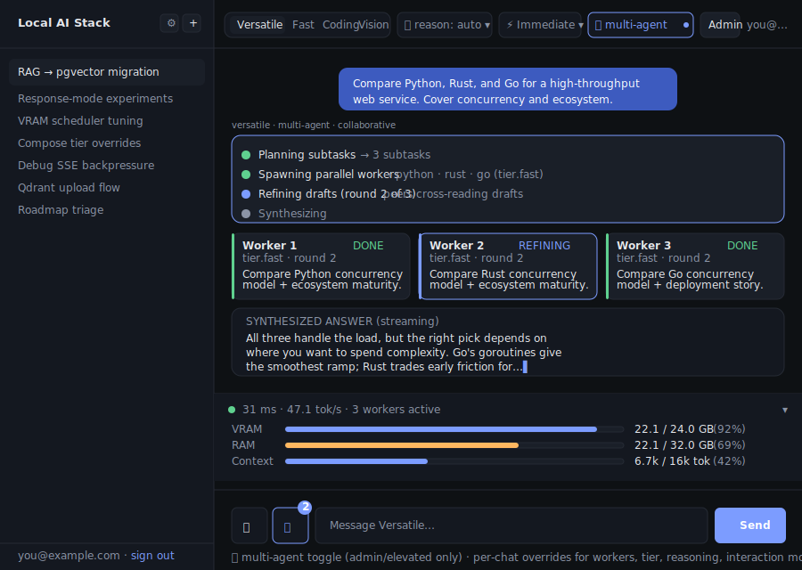
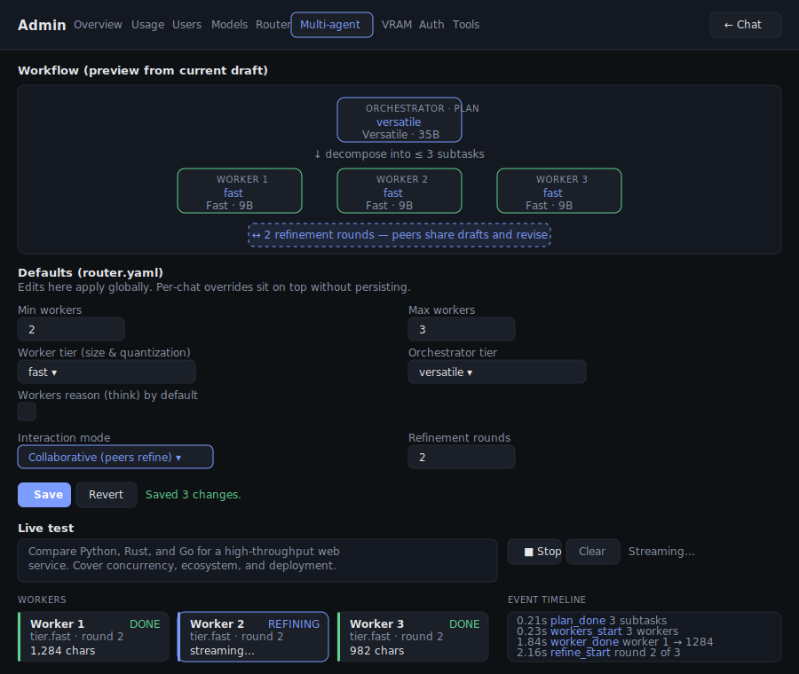
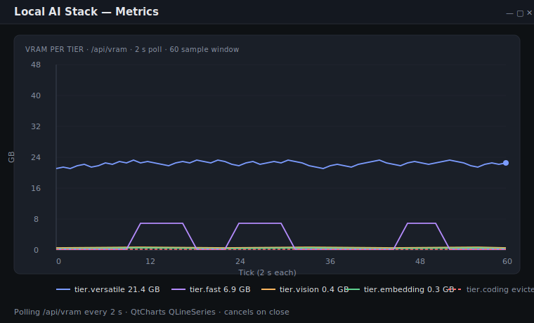
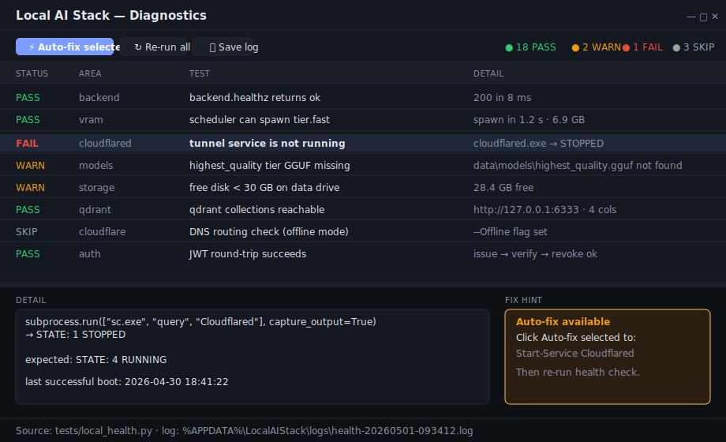
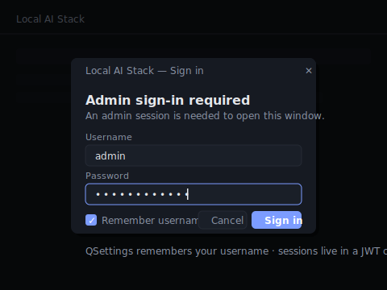

# Local AI Stack — native Windows mode

A self-hosted multi-model LLM workflow that runs entirely on a single Windows
machine. A FastAPI backend routes each chat request to one of six llama.cpp
tiers (four chat, one vision, one embedding) with a VRAM-aware scheduler, a
multi-agent orchestrator, per-user RAG + memory, and an OpenAI-compatible
SSE endpoint.

**No Docker. No browser dependency. No Electron.** Ships as a single
PowerShell launcher (`LocalAIStack.ps1`) and a native PySide6 desktop app.

<p align="center">
  
</p>

## Quickstart

```powershell
.\LocalAIStack.ps1 -InitEnv     # write a default .env (edit it: secrets, optional Brave key)
.\LocalAIStack.ps1 -Setup       # install prereqs, download binaries, create venvs, pull models
.\LocalAIStack.ps1              # start everything and launch the native Qt GUI
```

All operator instructions — daily commands, cloudflared ingress snippet,
log locations, model update policy, uninstall — live in:

```powershell
.\LocalAIStack.ps1 -Help
```

## What ships

| Path | What it is |
|---|---|
| [`LocalAIStack.ps1`](LocalAIStack.ps1) | One-file launcher: `-InitEnv`, `-Setup`, `-Start`, `-Stop`, `-Build`, `-BuildInstaller`, `-CheckUpdates`, `-Admin`, `-Test`, `-Help` |
| [`backend/`](backend/) | FastAPI app on `:18000` (chat SSE, auth, admin, RAG, memory, VRAM scheduler) |
| [`gui/`](gui/) | PySide6 native desktop app (chat, admin, diagnostics, metrics, setup wizard, system tray) |
| [`config/`](config/) | YAML-driven configuration (tiers, sources, router, VRAM, auth, tools) |
| [`tools/`](tools/) | 90+ discoverable tool modules (web, finance, science, data, dev) |
| [`tests/`](tests/) | Pytest suite + `local_health.py` health check (CI runs without GPU) |
| [`installer/`](installer/) | Inno Setup script + PyInstaller spec for the Windows installer |
| [`scripts/steps/`](scripts/steps/) | Helpers dot-sourced by `LocalAIStack.ps1` |
| `vendor/` *(generated)* | Pinned Qdrant + llama-server binaries and three Python venvs |
| `data/` *(generated)* | SQLite, encrypted histories, Qdrant storage, resolved-model cache, `.env` |

---

## GUI overview

The native desktop app lives in [`gui/`](gui/) and is built on PySide6
(no embedded browser, no JavaScript). Six windows cover the complete
operator surface; below is each one with its current visual.

### Setup wizard — first run

[`gui/windows/setup_wizard.py`](gui/windows/setup_wizard.py) — a 7-page
QWizard that runs automatically when `.env` is missing or no admin user
exists. Walks the operator through prerequisite checks (Python 3.12+,
cloudflared, NVIDIA driver), admin account creation, auto-generated
secrets, optional Cloudflare Tunnel provisioning, optional SMTP, and
the initial model pull. State is persisted to `data/.wizard_state.json`
so a crash mid-wizard doesn't lose typed input.

<p align="center">
  
</p>

### Chat — web (default) and native (airgap)

The canonical chat surface is the FastAPI-served web UI at
[`backend/static/chat.html`](backend/static/chat.html), reached over the
Cloudflare tunnel at `chat.<your-domain>` once provisioned. The Qt
[`ChatWindow`](gui/windows/chat.py) shows a guidance card pointing
users there.

When **airgap mode** is toggled on from the admin dashboard, the Qt
window swaps in-place to a full local chat UI: tier picker, reasoning
toggle, streaming markdown via [`MarkdownView`](gui/widgets/markdown_view.py)
(60 ms batched flush so token streams don't re-parse the whole document),
multi-agent visibility, and per-chat overrides. A `QTimer` polls
`/api/airgap` every 5 s and swaps modes live.

<p align="center">
  
</p>

### Admin dashboard

[`gui/windows/admin.py`](gui/windows/admin.py) is a full-fidelity
operator console — direct write-parity with what was previously a
Preact admin SPA. Nine tabs:

| Tab | What it controls |
|---|---|
| **Users** | Add / edit / promote / delete accounts; per-user password reset |
| **Models** | Live pull progress per tier, sourced from `/admin/model-pull-status` (5 s poll); replace any tier with a different GGUF |
| **Tools** | Toggle each of the 90+ tools on/off; see manifest + default-enabled set from [`config/tools.yaml`](config/tools.yaml) |
| **Airgap** | Switch between hosted (`chat.<domain>`) and on-device chat |
| **VRAM** | Per-tier residency table; mirrors `/vram` |
| **Router** | Multi-agent settings (min/max workers, tier choices, interaction mode, refinement rounds) and slash-command rules |
| **Auth** | Allowed email domains, session TTLs, rate limits |
| **Errors** | Recent backend exceptions (4-column timestamped log) |
| **Reload** | Hot-reload `config/*.yaml` without restarting the backend |

<p align="center">
  
</p>

#### Multi-agent orchestration (Router tab)

The Versatile MoE tier acts as an orchestrator: complex prompts are
decomposed into 2–5 parallel subtasks executed on the Fast tier and
synthesized back. Two interaction modes:

- **Independent** — classic parallel fan-out
- **Collaborative** — workers see each other's drafts and refine over
  N rounds before synthesis

<p align="center">
  
</p>

### Metrics — live VRAM chart

[`gui/windows/metrics.py`](gui/windows/metrics.py) opens a QtCharts
window that polls `/api/vram` every 2 s, keeps a 60-sample sliding
window per tier, and renders one `QLineSeries` per tier on a 0–48 GB
y-axis. The polling task cancels cleanly on close.

<p align="center">
  
</p>

### Diagnostics — health check viewer

[`gui/windows/diagnostics.py`](gui/windows/diagnostics.py) is spawned by
`tests/local_health.py` after the suite finishes. Color-coded tree
(green PASS / amber WARN / red FAIL / grey SKIP), selecting a row
reveals full detail and a fix hint. Failures with a registered fix
hook are auto-fixable from the toolbar.

<p align="center">
  
</p>

Run it directly with `.\LocalAIStack.ps1 -Test` (add `-Fix` to auto-apply
known fixes; add `-Area cloudflared` to scope to one area).

### Login dialog

[`gui/windows/login.py`](gui/windows/login.py) — a modal `QDialog` shown
before any window that requires an admin session. Authentication runs on
a `QThread` (not asyncio) to avoid deadlocking Qt's modal event loop.
QSettings persists the last username; the password is never stored.

<p align="center">
  
</p>

### System tray

[`gui/widgets/tray.py`](gui/widgets/tray.py) installs a `QSystemTrayIcon`
with shortcuts to open Chat, Admin, Metrics, view logs, and quit. The
tray icon swaps between **airgap OFF** and **airgap ON** every 5 s so
the operator always knows which mode is live without opening a window.

---

## Architecture

Services that used to run in containers now run as tracked subprocesses.
PIDs are written to `%APPDATA%\LocalAIStack\pids.json` so `-Stop`
terminates exactly what was started.

| Service | Port | How it runs |
|---|---|---|
| `backend` (FastAPI) | 18000 | uvicorn (venv-backend) |
| `llama-server` (vision) | 8001 | Vendored binary, **pre-spawned** at boot |
| `llama-server` (embedding) | 8090 | Vendored binary, **pre-spawned** at boot, `--embedding` |
| `llama-server` (chat tiers) | 8010-8013 | Vendored binary, **cold-spawned** by `VRAMScheduler` on first request |
| `qdrant` | 6333 | Vendored binary (`vendor/qdrant/`) |
| `jupyter` | 8888 | venv-jupyter subprocess (sandbox for the `jupyter_tool`) |
| `cloudflared` | — | Optional Windows service (installed by the wizard) |
| `gui` | — | PySide6 app, no listening port |

The launcher dot-sources [`scripts/steps/`](scripts/steps/) for setup
helpers (prereq install, binary downloads, venv creation, CUDA runtime
provisioning). Pinned versions (`b8992` llama-server, `v1.12.4` Qdrant)
are SHA256-verified.

## Tiers

All six tiers live in [`config/models.yaml`](config/models.yaml). Every
tier runs with `--cache-type-k q8_0 --cache-type-v q8_0 -fa --jinja`,
so context windows are pushed to each model's native max within a 24 GB
card budget. Vision and embedding are pinned and pre-spawned; chat
tiers cold-spawn on first request via the
[`VRAMScheduler`](backend/vram_scheduler.py).

| Tier | Model | Port | `--ctx-size` | VRAM | Role |
|---|---|---|---|---|---|
| `highest_quality` | Qwen3 72B | 8010 | 32 768 | ~24 GB | Hardest reasoning |
| `versatile` | Qwen3.6 35B-A3B (MoE) | 8011 | 65 536 (YaRN ×2) | ~21 GB | Default + orchestrator |
| `fast` | Qwen3.5 9B | 8012 | 65 536 | ~7 GB | Multi-agent workers |
| `coding` | Qwen3-Coder-Next 80B-A3B | 8013 | 131 072 (YaRN ×4) | ~24 GB | SWE-bench trained |
| `vision` | Qwen3.6 35B + mmproj | 8001 | 16 384 | ~21 GB | Images / charts |
| `embedding` | nomic-embed-text-v1.5 | 8090 | 8 192 | ~1 GB | RAG + memory distillation |

GGUF resolution runs on every `-Start` against
[`config/model-sources.yaml`](config/model-sources.yaml); cached results
land in `data/models/`. Slash overrides at chat time: `/tier`, `/think`,
`/solo`, `/swarm`.

## Configuration

All runtime configuration lives in [`config/`](config/):

- [`models.yaml`](config/models.yaml) — tier definitions + aliases
- [`model-sources.yaml`](config/model-sources.yaml) — Hugging Face GGUF resolver
- [`router.yaml`](config/router.yaml) — auto-thinking / multi-agent / specialist rules
- [`vram.yaml`](config/vram.yaml) — scheduler policy (headroom, eviction, pinning)
- [`auth.yaml`](config/auth.yaml) — session TTL, allowed domains, rate limits
- [`tools.yaml`](config/tools.yaml) — tool manifest + default-enabled set
- [`runtime.yaml`](config/runtime.yaml) — backend + llama-server runtime knobs

Secrets (`AUTH_SECRET_KEY`, `HISTORY_SECRET_KEY`, SMTP creds, Hugging
Face token) live in `.env` at the repo root, written by the setup
wizard or `-InitEnv`. Never committed.

## API endpoints

OpenAI-compatible streaming chat is the headline; the rest is the
operator surface that the admin window talks to.

```
GET    /healthz                     → {status: "ok"|"degraded"}
GET    /v1/models                   → OpenAI-compatible tier list
POST   /v1/chat/completions         → SSE streaming chat (OpenAI-compatible)

POST   /auth/login                  → username + password → JWT cookie
POST   /auth/logout                 → clear session
POST   /auth/change-password        → rotate password
GET    /me                          → current user
GET    /api/airgap                  → {enabled: bool}

POST   /rag/upload                  → upload a document into per-user RAG
GET    /rag/docs                    → list uploaded documents
DELETE /rag/docs/{doc_id}           → forget a document
GET    /memory                      → list distilled memories
DELETE /memory/{id}                 → forget a memory

GET    /vram                        → current tier residency snapshot
GET    /system                      → host info (CPU, RAM, GPU)
GET    /tools                       → tool manifest

GET    /chats                       → list conversations
POST   /chats                       → create a conversation
GET    /chats/{id}                  → conversation history
PATCH  /chats/{id}                  → rename / pin
DELETE /chats/{id}                  → delete

# Admin (require admin session)
GET    /admin/overview              → dashboard counts
GET    /admin/users                 → list users
POST   /admin/users                 → create user
PATCH  /admin/users/{id}            → update user
DELETE /admin/users/{id}            → delete user
GET    /admin/model-pull-status     → live pull progress per tier
GET    /admin/usage                 → request volume + token totals
GET    /admin/errors                → recent backend exceptions
GET    /admin/vram                  → per-tier residency
GET    /admin/tools                 → tool toggle state
PATCH  /admin/tools/{name}          → enable/disable a tool
GET    /admin/config                → resolved YAML config
PATCH  /admin/config                → write-through update
POST   /admin/reload                → hot-reload all YAML
GET    /admin/airgap                → airgap state
PATCH  /admin/airgap                → toggle airgap
```

## Tools, RAG, memory

- **Tools.** [`tools/`](tools/) holds 90+ self-contained modules (web
  search, finance, science, dev utils, data repos). The registry is
  driven by [`config/tools.yaml`](config/tools.yaml); each tool exposes
  its JSON schema and is enable/disable-able from the admin Tools tab.
- **RAG.** Per-user collections in Qdrant, populated via `/rag/upload`.
  Embeddings are computed on the always-on `llama-server --embedding`
  pinned to port 8090.
- **Memory.** Every Nth turn the orchestrator distills durable facts
  from chat history and stores them per-user; relevant memories are
  injected into prompts on subsequent turns.

## Development

```powershell
# Backend in reload mode (requires Qdrant + the embedding llama-server)
.\LocalAIStack.ps1 -Start -NoGui

# Pytest suite (Linux CI — no GPU required)
python -m pytest tests/

# Local health check on the actual machine after setup
.\LocalAIStack.ps1 -Test                    # runs every area
.\LocalAIStack.ps1 -Test -Area cloudflared  # one area
.\LocalAIStack.ps1 -Test -Fix               # auto-apply known fixes

# Build the desktop app (PyInstaller) + Inno Setup installer
.\LocalAIStack.ps1 -Build
.\LocalAIStack.ps1 -BuildInstaller
```

CI is in [`.github/workflows/`](.github/workflows/):
`ci.yml` runs the pytest suite on Linux; `install-and-startup.yml`
exercises the full `-Setup` → `-Start` flow on a Windows runner.

### Project layout

```
LocalAIStack.ps1      Root launcher (setup / start / stop / build / test / help)
backend/              FastAPI app
  main.py             Endpoints, SSE producers, middleware pipeline
  admin.py            Admin endpoints (users, models, tools, config, reload)
  router.py           Tier selection + slash commands
  vram_scheduler.py   GPU residency manager (LRU + ref-count)
  orchestrator.py     Multi-agent plan/synthesize (independent + collaborative)
  rag.py              Per-user Qdrant retrieval
  memory.py           Distillation + injection
  auth.py             Password auth + JWT cookies
  airgap.py           Airgap state + middleware
  diagnostics.py      Health-check primitives (consumed by tests/local_health.py)
  history_store.py    Encrypted SQLite chat history (per-user key)
  kv_cache_manager.py llama-server KV-cache lifecycle
  model_resolver.py   Hugging Face GGUF resolver
  model_residency.py  Pin/evict policy
  metrics.py          Prometheus-style counters
  middleware/         Auth, host gate, request logging, rate limiting
  backends/           llama.cpp + future provider adapters
  static/chat.html    Web chat UI served by FastAPI
  tools/              Backend-side tool plumbing (registry, dispatcher)
gui/                  PySide6 native desktop app
  main.py             Tray + window registry + asyncio integration
  api_client.py       Typed async client for backend endpoints
  cloudflare_setup.py Tunnel provisioning helpers
  windows/            chat.py · admin.py · login.py · diagnostics.py
                      · setup_wizard.py · metrics.py
  widgets/            tray.py · markdown_view.py
config/               YAML-driven runtime configuration
tools/                Discoverable tools (one file per tool, 90+)
scripts/
  steps/              Dot-sourced helpers (prereqs, downloads, venvs, CUDA)
  prompts/            Prompt templates
  code_assist.py      Repo helper utilities
installer/            Inno Setup script + PyInstaller spec
tests/
  local_health.py     Operator-facing health check + fix hooks
  health_areas/       One file per area (backend, vram, cloudflared, …)
  test_*.py           Pytest suite (no GPU required, runs in Linux CI)
docs/
  overview.md         Architecture + tier table
  manual-setup.md     Manual install (when you don't trust the wizard)
  backend-startup.md  What happens between launcher and ready-state
  images/             SVG mockups (referenced by this README)
.github/workflows/    ci.yml · install-and-startup.yml · update-project-fields.yml
```

## Roadmap & contributing

- [#34 Admin platform & config](https://github.com/kitisathreat/local-ai-stack/issues/34)
- [#36 Scaling & performance](https://github.com/kitisathreat/local-ai-stack/issues/36)
- [#37 Tooling quality & tests](https://github.com/kitisathreat/local-ai-stack/issues/37)
- [#38 Docs & security](https://github.com/kitisathreat/local-ai-stack/issues/38)
- [#39 Stability & correctness](https://github.com/kitisathreat/local-ai-stack/issues/39)

## Phase history

- **Phase 0** — Docker-compose + Preact scaffolding (later removed)
- **Phase 1** — Backend-agnostic tier router + VRAM scheduler + multi-agent orchestrator
- **Phase 4** — Auth + per-user storage
- **Phase 5** — Tool registry, per-user RAG, memory distillation
- **Phase 6** — Cloudflare Tunnel, middleware migration, airgap toggle
- **Phase 7** — Native Windows migration: no Docker, PySide6 GUI, setup
  wizard, Inno Setup installer, local health-check suite
- **Phase 8** — Migration from Ollama to native llama.cpp for all tiers,
  unlocking native-max context windows via KV-cache quantization

## License

See repository settings.
